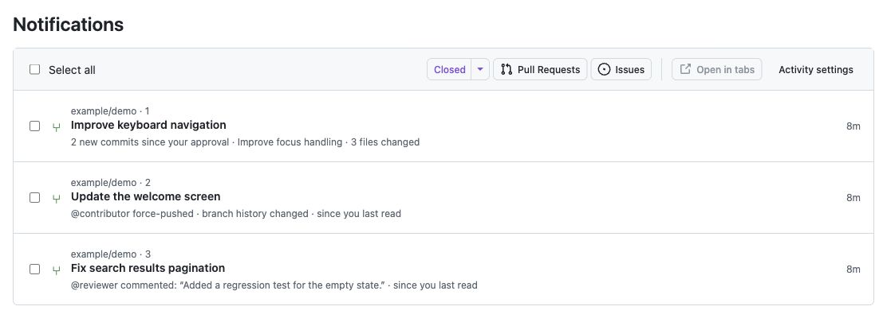
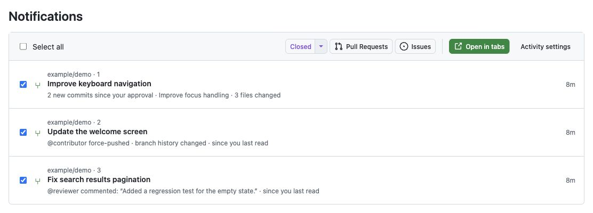

# GitHub Notification Actions

A Chrome extension that adds compact controls on the right side of the notification action bar in GitHub's notifications inbox:

- Closed: select closed issues (including not planned) and closed or merged PRs. The main button always selects both types; its caret menu immediately selects only closed Pull Requests or Issues.
- Issues: select issues in any state.
- Pull Requests: select pull requests in any state, including drafts.
- Open in tabs: opens selected notifications in background tabs; becomes active when at least one item is selected.

Selection buttons replace the current selection using GitHub's existing checkboxes. Actions apply only to the current page, including when grouped by repository or filtered. Manually selected notifications are included when opening tabs. Existing selections remain checked after opening.

## Screenshots

These screenshots use the extension's actual controls in a local demo with entirely fictional notifications. No GitHub repository content, usernames, or avatars are included.

Activity summaries beneath notification titles:

Bulk selection with the active Open in tabs button:

## Install

1. Open `chrome://extensions` in Chrome.
2. Enable **Developer mode**.
3. Click **Load unpacked** and choose this folder (`/Users/luke/src/github-chrome`).
4. Reload any open GitHub tab, then visit https://github.com/notifications.

No build or token is required for bulk actions. Activity summaries are optional and require a GitHub connection. After editing the extension, click its reload button in `chrome://extensions` and reload GitHub.

## Activity summaries

1. Reload the extension in `chrome://extensions` and refresh GitHub Notifications.
2. Click Activity settings in the notification action bar.
3. Create a personal access token (classic) with `repo` and `notifications` scopes, with an expiration date. Authorize organization SSO if needed.
4. Paste the token into the extension settings and click Connect GitHub. Allow the optional api.github.com permission when Chrome asks.
5. Return to the inbox. Summaries load below visible PR and issue titles.

The token is stored in `chrome.storage.local`, restricted to trusted extension contexts. It is not synced and never sent to the GitHub webpage. Chrome's local extension storage is not an encrypted credential vault. The classic `repo` scope grants write access, although this extension only sends reads and GraphQL queries. Fine-grained tokens are not supported because the notification API requires a classic token. Use a token for the same account signed into the page. Disconnect clears the token and cached activity.

The latest submitted review and notification last-read timestamp establish the baseline, choosing whichever is newer. Without either, the summary describes recent activity and its tooltip explicitly says no baseline is available. Comments, review requests, submitted reviews (including an inline comment excerpt), state changes, commits, and force-pushes are supported. The tooltip provides the baseline and additional context. A force-push is never classified as a rebase-only change.

Commit counts compare the reviewed SHA with the current head and include only commits belonging to the PR; unrelated base-branch commits are excluded. Comparisons after diverged history do not produce a new-commit count. GitHub can make old commits inaccessible, in which case timeline summaries remain available. File counts are omitted when GitHub's comparison response may be truncated.

Only visible/nearby rows load, two at a time. Activity and notification metadata are cached for two minutes in trusted browser-session storage, surviving service-worker restarts but not browser restarts. Returning to the inbox refreshes the view; it also refreshes every two minutes while visible. Rate-limit responses pause requests. Pagination is followed for notification baselines, events since the baseline, and commit comparisons; oversized histories return an explicit unavailable message. With no baseline, only the latest 100 timeline items are inspected and any truncation is disclosed in the tooltip.

Summary reads do not mark notifications read, submit reviews, or change subscriptions. An activity summary describes observed changes, not a guaranteed explanation of which event caused GitHub to notify you. Repository access errors appear inline with details on hover. Tokens and API responses are never sent to a third-party service.

## Permissions and behavior

The content script runs on `github.com` so it can detect navigation into notifications without a full page reload. Its controls appear only at `/notifications` (including filters/query strings). Bulk selection reads notification icons and links already on the page. When connected, activity summaries make read-only requests to api.github.com. Status accuracy follows GitHub's displayed icons. Opening a notification can mark it read through GitHub's normal behavior.

Tab creation uses Chrome's service worker API so popup blocking does not prevent bulk opening. No `tabs` permission is needed to create tabs; the extension does not read browsing history. The storage permission holds the local connection and session cache; api.github.com access is optional and requested only when connecting. Chrome 123 or later is required.

## Development

Run `npm install`, `npm test`, and `npm run lint` with Node.js 20 or later. The extension itself has no dependencies or build step; development dependencies are only for DOM tests and linting.

The DOM integration uses GitHub's notification row, checkbox, link, and status icon classes, cross-checked with [Refined GitHub's notification selection implementation](https://github.com/refined-github/refined-github/blob/main/source/features/select-notifications.tsx). GitHub markup changes may require selector updates. Automated tests cover representative DOM fixtures, API pagination/caching/errors, credential isolation, and summary wording. The activity reader has also been exercised against live PR and issue API responses; connecting a token in your Chrome profile completes setup.
